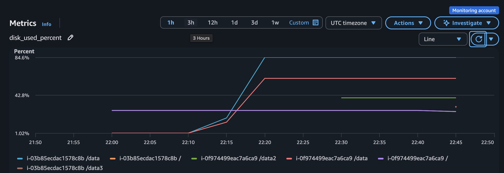
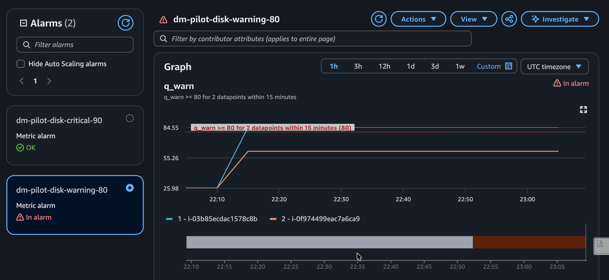
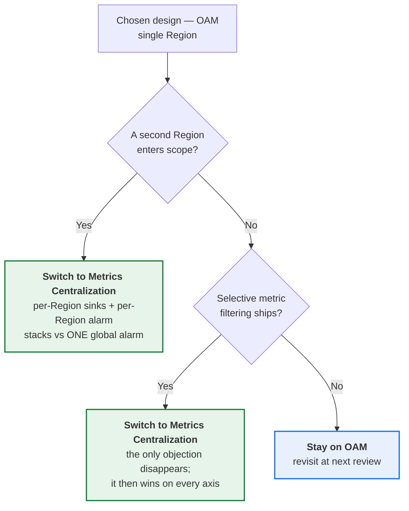

# Disk Utilization Monitoring at Scale — AWS + Ansible

Detect low disk space early across many AWS accounts, before it causes downtime.

Built for the brief *"Scalable Disk Monitoring Solution for Cloud Environments"* — a
multi-account AWS estate grown through acquisition, where Ansible is already the
configuration-management tool and cloud-native services are to be added **only where they
earn their place**.

---

## Table of contents

1. [The problem](#1-the-problem)
2. [The approach](#2-the-approach)
3. [Architecture](#3-architecture)
4. [How it works, component by component](#4-how-it-works-component-by-component)
5. [Live results — pilot across two AWS accounts](#5-live-results--pilot-across-two-aws-accounts)
6. [How the brief is answered](#6-how-the-brief-is-answered)
7. [Assumptions](#7-assumptions)
8. [Limitations](#8-limitations)
9. [Cost](#9-cost)
10. [Alternative solution considered](#10-alternative-solution-considered--metrics-centralization)
11. [Deploying it](#11-deploying-it)

---

## 1. The problem

Disk exhaustion is one of the most avoidable causes of production downtime, and one of the
most damaging when it lands. When a filesystem reaches 100%, writes fail with `ENOSPC`: the
application stops accepting work, logs stop being written at exactly the moment they are
needed to diagnose it, databases refuse transactions, and recovery needs a human on a host
that may already have stopped responding.

**What makes it worth engineering against is that it is slow and entirely predictable.**
Unlike a hardware fault or a bad deploy, a disk passes 80% long before it passes 100% —
usually hours or days before. An outage caused by a full disk is therefore an outage that
monitoring should have caught, which makes the absence of that monitoring the real defect.

**At this scale the hard part is not detection, it is reach.** The estate grew through
acquisition: many AWS accounts, no common inventory, no shared credentials, and no guarantee
that any two accounts were built the same way. Each account is its own IAM boundary *and* its
own CloudWatch boundary, so there is no single console to watch, nothing to log into
uniformly, and no authoritative list of what is even running. Anything built here has to work
without being told what exists — and has to keep working as accounts and instances appear.

The obvious first move is to alarm on an AWS metric that already exists. That move fails, for
a structural reason worth establishing before anything else, because **every other decision
in this design follows from it**.

### EC2 does not report filesystem fullness

`AWS/EC2` publishes CPU, network and status checks. No disk-space metric. `AWS/EBS` looks
like the answer and is not:

| `AWS/EBS` metric | What it actually measures |
|---|---|
| `VolumeReadOps` / `VolumeWriteOps` | I/O operation counts |
| `VolumeReadBytes` / `VolumeWriteBytes` | Bytes transferred |
| `VolumeQueueLength` | Requests waiting |
| `VolumeIdleTime` | Time with no I/O |
| `BurstBalance` | Remaining burst credits |

Every one measures **I/O activity, not occupancy**. AWS's own EBS documentation redirects the
question: *"To get information about the available disk space from the operating system on an
instance, see View free disk space."*

**This is architectural, not an oversight.** EBS is a block device — it serves numbered blocks
and has no concept of a file or a filesystem. "How full is it?" depends on which filesystem was
created on those blocks, its metadata overhead, its reserved-block setting, and what the guest
has written. That knowledge exists **only inside the guest OS**.

The failure mode this creates is the dangerous one:

> **A completely full disk generates near-zero EBS activity.** No write can succeed, so no write
> is reported. `VolumeWriteOps` falls, `VolumeIdleTime` rises, `BurstBalance` sits at 100% —
> every EBS metric looks *healthier than usual* — while the application is dying on `ENOSPC`.

**Therefore an in-guest agent is mandatory.** There is no AWS-side substitute, and no amount of
clever alarming on `AWS/EBS` recovers the signal.

### How this design answers it

Four moves, in the order the data flows. **An in-guest agent supplies the signal AWS cannot**,
publishing filesystem occupancy continuously rather than on a schedule. **Ansible configures
that agent across every account over SSM Session Manager** — no SSH keys, no inbound ports, no
bastion — discovering hosts from tags at runtime so no inventory has to be maintained by hand.
**OAM makes every account's metrics queryable from one place at zero cost and with no data
movement.** And **Metrics Insights alarms cover the entire fleet without a single alarm being
created per instance**, adopting new hosts automatically as they appear.

The rest of this document works through that in order: the principles behind those choices
(§2), the architecture (§3), each component in turn (§4), what a live two-account pilot
actually proved (§5), and then the specific questions this design was set (§6).

---

## 2. The approach

Four principles, each a direct response to something in the brief.

**1. Reuse the existing stack; add cloud-native services only where they earn it.**
Ansible remains the configuration-management tool and does what it is genuinely good at —
converging host state. It is deliberately **not** used as the metrics pipeline (see §4.3 for
why that distinction is load-bearing). CloudWatch is added because the metric must come from
inside the guest and must be alarmable; OAM is added because it centralizes across accounts at
**zero cost and zero data movement**. Nothing third-party is introduced: no second agent, no
second credential system, no second bill.

**2. Nothing is hand-maintained per account or per VM.**
No host list. No account list. No per-instance alarm. Inventory is derived from **tags at
runtime**, the account list comes from `organizations:ListAccounts` on every run, and coverage
is a **query** rather than a set of alarm resources. This is what makes the design O(1) to
operate at any fleet size — and, more importantly, makes it impossible to onboard an account
*incompletely* by updating two of three lists.

**3. Security posture inherited, not bolted on.**
Access is **SSM Session Manager**: outbound-only agent, IAM-authorized, CloudTrail-attributed
per command, working in private subnets with **no SSH keys, no inbound ports, no bastion**.
Instances hold minimal, local permissions. Cross-account trust is bounded by AWS-enforced org
membership rather than a shared secret.

**4. Silent failure is treated as the primary risk.**
A disk-monitoring system that looks healthy while monitoring nothing is worse than one that is
visibly broken. Several design choices exist purely to convert silent failures into loud ones —
the config-validation gate, the `PARTIAL_DATA` guard alarm, the deployment-order dimension gate.
Where a silent mode still exists, it is named in [§8](#8-limitations) rather than hidden.

### In one paragraph

An **Ansible controller** in a monitoring account reaches instances over **SSM Session Manager**.
It discovers them from **tag-filtered dynamic inventory**, so there is no host list anywhere. On
each host it installs the **CloudWatch agent** and generates that host's config from its own
filesystems (`ansible_mounts`) — which is both the correct result and the cost control. The
agent then publishes `disk_used_percent` **every 60 seconds, continuously**; Ansible never
carries a measurement. **OAM** shares those metrics into the monitoring account for free, where
**Metrics Insights alarms** cover every instance and adopt new ones automatically. At 80% a
notification goes out; at 90% an SSM Automation runbook snapshots and grows the EBS volume.

---

## 3. Architecture


**Reading it, top to bottom.** The **management account** holds AWS Organizations and the
CloudFormation StackSet, which auto-deploys the baseline into every account in a target OU —
this is the arrow that makes onboarding an acquired account a single action. The **workload
accounts** (Production, Staging, Development, one per OU) are deliberately drawn identically,
because they are: the same instance profile, Config required-tags rule, EventBridge rules and
VPC endpoints appear in each, with the SSM + CloudWatch agent on the instance and its gp3
volume. The **monitoring account** at the bottom is the hub — Ansible controller, Session
Manager, OAM sink and dashboard, cross-account roles, and the module-transfer bucket.

**Two flows matter, and they run in opposite directions.** *Configuration* goes **up** from the
hub: the controller reaches each instance over **SSM Session Manager**, with no SSH keys and no
inbound ports. *Telemetry* comes **down**: each account's agent publishes `disk_used_percent`
into its **own** CloudWatch every 60 seconds, and the OAM link makes it queryable centrally
without the data ever moving. Note what is *not* drawn — there is no path from the hub into a
workload account's metrics store, because none exists or is needed.

Five supporting diagrams — the configuration-vs-data split, the enrollment sequence, alarm
contributor fan-out, the cost model, and the text-based version of this one — are in
[`architecture/architecture.md`](architecture/architecture.md).

Additional diagrams — the two-path model, the enrollment sequence, alarm contributor fan-out and
the cost model — are in [`architecture/architecture.md`](architecture/architecture.md).

---

## 4. How it works, component by component

Following the data: from reaching a VM, to producing the number, to centralizing it, to deciding
something is wrong, to fixing it.

### 4.1 Access management — reaching VMs across accounts

**Decision: AWS Systems Manager, not SSH.** The SSM Agent makes an **outbound** connection and
polls for work. Nothing connects inward.

| Property | Consequence |
|---|---|
| Outbound-only | **No inbound rules** on instance security groups; no public IP |
| IAM-based authorization | Revoking access is one policy change, not a visit to every VM |
| CloudTrail per command | Attributed to an IAM principal, by default |
| Works in private subnets | No bastion, no NAT (with endpoints) |

**Rejected — SSH with bastions:** key generation, distribution and rotation across ~50 accounts;
inbound port 22; a bastion fleet that must itself be patched; no per-command audit trail without
building one. The failure mode that matters in practice is an ex-employee's key still sitting on
a host nobody remembers. **Rejected — EC2 Instance Connect:** solves key *distribution* but is
still SSH, still needs reachability, and is **interactive-only** — no scheduled automation.

**Instance identity — one standardized profile** carrying `AmazonSSMManagedInstanceCore` (so the
agent registers) and `CloudWatchAgentServerPolicy` (so it can call `PutMetricData`). One profile
serves unlimited instances, so there is no per-instance IAM object; the quota is **one profile
*per instance***, which is exactly why a single profile carries both policies.

**Cross-account trust uses two different condition keys, on opposite sides, and they are not
interchangeable:**

| Key | Describes | Used where |
|---|---|---|
| `aws:PrincipalOrgID` | org of the **caller** | Workload role trust policies — "only principals in my org may assume this" |
| `aws:ResourceOrgID` | org of the **resource** | Controller's `sts:AssumeRole` — "only roles in my org may be assumed" |

The controller's policy names `arn:aws:iam::*:role/DiskMonitoring*Role` — a **wildcard account** —
so the *target* is what needs bounding. `aws:PrincipalOrgID` there would be **tautologically
true** (the caller is always the controller, always in the org): it looks like a restriction
while permitting any outside account that creates a same-named role trusting this controller.

**`sts:ExternalId` is deliberately absent.** It solves the **confused deputy** problem, which is
inherently a *third-party* scenario — a vendor serving many customers. Inside one Organization
there is no third party and no deputy. `aws:PrincipalOrgID` is strictly stronger: enforced by AWS
from org membership and impossible to leak, where an ExternalId is a shared string sitting in
IaC.

**Network — VPC endpoints, for the controller as well as the instances.** With no internet
egress these are mandatory rather than an optimization. The one most easily forgotten is
**`monitoring`**: without it SSM works, Ansible succeeds, the agent runs — and no metric ever
arrives, because `PutMetricData` cannot reach CloudWatch. Two further traps: *"no inbound rules
on instances"* is not *"no rules anywhere"* — the **endpoints** need 443 inbound from the
instance SG; and the **global** STS endpoint `sts.amazonaws.com` **bypasses a VPC endpoint
entirely**, so the controller must export `AWS_STS_REGIONAL_ENDPOINTS=regional` or the endpoint
is billed and silently unused.

→ [`docs/01-access-management.md`](docs/01-access-management.md) ·
[`cloudformation/10-workload-iam.yaml`](cloudformation/10-workload-iam.yaml) ·
[`cloudformation/11-workload-endpoints.yaml`](cloudformation/11-workload-endpoints.yaml) ·
[`cloudformation/12-monitoring-endpoints.yaml`](cloudformation/12-monitoring-endpoints.yaml)

### 4.2 VM discovery & enrollment

**The tag is the entire interface.** There is no host list. Inventory is *derived* from tags on
every run — tag an instance and it is in scope; **un-tag it and it is out**, which doubles as a
clean off switch for maintenance windows.

```yaml
filters:
  tag:DiskMonitoring: enabled
  instance-state-name: running     # a CORRECTNESS filter, not an optimization
```

That second filter looks like tidiness and is not. Without it, `stopped` / `terminated` /
`pending` instances enter inventory, Ansible attempts Session Manager connections that **cannot**
succeed, and each becomes a **task failure — not a skip**. Failures count toward
`max_fail_percentage`, so enough dead instances **abort the run for the healthy ones**. Terminated
instances linger in `describe-instances` for up to an hour, so this is routine in any fleet with
churn.

**Coverage is made default-on by two AWS Config rules**, both change-triggered so correction
happens promptly rather than on a 24-hour sweep:

| Rule | Detects | Remediation |
|---|---|---|
| `required-tags` | instance missing `DiskMonitoring=enabled` | applies the tag → which itself fires Rule 2 |
| `ec2-instance-profile-attached` | instance with no instance profile | associates it — effective in minutes, **no reboot** |

**Profile and tag are jointly necessary, neither sufficient** — and the two failure modes are
asymmetric:

| State | What happens | Symptom |
|---|---|---|
| Tagged, no profile | not an SSM managed node; inventory targets it, connection cannot be established | Ansible **task failure** on a host that looks correct |
| Profiled, no tag | is a managed node, but **invisible to inventory** | **total silence** — nothing fails, nothing runs, nothing reports |

The second is worse precisely because nothing complains. Both Config rules exist because both
halves are required.

**Three EventBridge rules, and no schedule:**

```
Rule 1 — instance reaches `running`         → configure it
Rule 2 — DiskMonitoring or Environment tag changes → configure it
Rule 3 — a workload stack reaches CREATE_COMPLETE  → bulk-configure the whole new account
```

**Rule 2 is required, not optional.** With no scheduled sweep, an instance tagged *after* launch
would **never** be enrolled — the launch event already fired, found it absent from tag-filtered
inventory, did nothing, and will never fire again:

```
T+0     launches untagged  → Rule 1 fires → not in inventory → no-op
T+~2m   Config remediation applies DiskMonitoring
                           → Rule 2 fires → configured ✅
```

Rule 2 makes **Config's own remediation the enrollment trigger**, closing the loop with no
scheduler. It also watches `Environment`, because `Environment` is a **metric dimension**: if it
arrives late and nothing re-runs, metrics publish `Environment=unscoped` permanently and the
instance sits **outside** its environment-scoped alarm — monitored but not covered, **and it
looks fine**.

**Rule 3 covers what Rules 1 and 2 structurally cannot** — an acquired account's *existing*
instances. No launch event will ever fire for them, and a tag-change event fires only if a tag
was *missing*. So an instance that **already** carried `DiskMonitoring=enabled` — because the
acquired team happened to use that tag name — generates **no event at all**. That instance looks
*more* correct than its neighbours and is the one that stays unmonitored.

→ [`ansible/inventory/aws_ec2.yml.template`](ansible/inventory/aws_ec2.yml.template) ·
[`docs/05-scalability.md`](docs/05-scalability.md)

### 4.3 Data collection on the host

The Ansible role does exactly four things: verify SSM Agent is running, **select which
filesystems to monitor**, install the CloudWatch agent, and render its config. A handler reloads
the agent **only when the config actually changed**, so re-runs do not disturb a healthy agent.

**The structural idea — Ansible configures, the agent collects:**

| | Path 1 — Ansible | Path 2 — CloudWatch agent |
|---|---|---|
| Question answered | *Which* filesystems exist — **structural** | *How full* are they now — **temporal** |
| Reads mounts | once per run | **every 60 seconds** |
| Produces | a config file | a continuous metric stream |
| If it stops | config goes stale | **metrics stop — you are blind** |

**Ansible deliberately never carries a measurement**, even though `ansible_mounts` hands it
`size_available` on a plate. A scheduled tool produces datapoints only when it runs, so a disk
filling between runs is **invisible** — and disk exhaustion develops precisely on the timescale a
config-management tool cannot see. Confirming evidence from the ecosystem: **there is no Ansible
module for `cloudwatch:PutMetricData`** in `amazon.aws`, `community.aws` or `amazon.cloud`.
Ansible was never intended as a metrics pipeline, and the absence of the module is the ecosystem
saying so.

**The mount list is computed from the host's own facts** — this is simultaneously the correct
answer and the cost control:

```jinja
{{ ansible_mounts
   | selectattr('fstype', 'in', cw_agent_allowed_fstypes)   {# ext2/3/4, xfs, btrfs #}
   | rejectattr('fstype', 'in', cw_agent_ignore_fstypes)
   | map(attribute='mount') | sort | list }}
```

CloudWatch bills per **unique dimension combination**, so `metrics = instances × monitored
mounts`. Three guards attack that product from different directions:

| Guard | Mechanism | Failure it prevents |
|---|---|---|
| enumerate from facts, **never `resources: ["*"]`** | bounds the set to real filesystems | unbounded metric count (~11× on container hosts) |
| `ignore_file_system_types` | filters pseudo-filesystems at the agent | the overlay explosion |
| `drop_device: true` | **removes a dimension** | multiplication, not merely extra rows |

The third is structurally strongest: filters reduce a *count*, but removing a dimension removes a
*factor from the product*.

**Two subtleties that are easy to get wrong and fail silently:**

**`Environment` must live inside the `disk` section**, not at `metrics` level. The `metrics`-level
`append_dimensions` block supports exactly four keys — `ImageId`, `InstanceId`, `InstanceType`,
`AutoScalingGroupName` — because it is the EC2-metadata enrichment hook, not a general dimension
bag. **Anything else there is silently dropped**: no parse error, no log line, the agent starts
happily and simply does not emit it. Verified live in the pilot.

**`drop_device: true` removes `device` and nothing else.** `fstype` survives, so the emitted set
is **four** dimensions — `InstanceId, path, Environment, fstype`. This matters enormously in §4.6.

→ [`ansible/roles/cw_agent/`](ansible/roles/cw_agent/) ·
[`docs/03-collection.md`](docs/03-collection.md)

### 4.4 Centralization — one query surface across every account

CloudWatch is **regional and per-account**. Fifty accounts would otherwise mean fifty consoles,
with alarms created and maintained in all fifty.

**Decision: CloudWatch Observability Access Manager (OAM).** The monitoring account hosts a
`Sink`; each workload account creates a `Link` pointing at it. From then on the monitoring
account queries that account's metrics as if they were local.

**Bilateral consent by design** — the sink policy says who *may* attach, the link says who *does*.
Neither alone suffices, so **account isolation is preserved** (the monitoring account cannot reach
in and harvest data from an account that has not opted in) and **both halves are auditable**, each
as a resource in its own account's stack.

| Property | Consequence |
|---|---|
| Metric sharing is **free** | centralization adds no per-metric cost |
| **No data movement** — query access, not copies | nothing to fall behind, no backfill, no pipeline to operate |
| Native alarming and dashboards | cross-account alarms work with no extra machinery |
| 100,000 source accounts per sink | 50 accounts is not near any boundary |

The sink policy is scoped by **`aws:PrincipalOrgID`** rather than an enumerated account list, so
**a new account links with no policy edit** — one of three independent mechanisms (with StackSet
OU targeting and runtime `ListAccounts`) that all key on org membership instead of a list.

**Rejected — cross-account metric push** (instances call `PutMetricData` into the monitoring
account directly). The decisive objection is **blast-radius inversion**: every instance in every
account would hold credentials to write into central monitoring, so one compromised host can
flood or poison monitoring **for the entire estate** — and monitoring data is exactly what an
attacker wants to suppress. It also destroys trustworthy attribution: under OAM `AWS.AccountId`
is applied **by AWS**, whereas here it would be a dimension the *instance* sets, and therefore
spoofable.

**Rejected — metric streams → Firehose → S3/OpenSearch.** Pays three times where OAM is free
(per metric update, per-GB Firehose, destination storage), you own the pipeline, and you rebuild
alarming in the destination because CloudWatch alarms do not evaluate data that has left
CloudWatch. Right only for retention beyond CloudWatch's 15 months.

The larger alternative — **Metrics Centralization** — is evaluated in full in
[§10](#10-alternative-solution-considered--metrics-centralization).

→ [`docs/04-aggregation-alarming.md`](docs/04-aggregation-alarming.md) ·
[`cloudformation/00-monitoring-account.yaml`](cloudformation/00-monitoring-account.yaml)

### 4.5 Presentation — the dashboard

**Alarms decide; dashboards explain.** Neither replaces the other — an alarm cannot show a trend,
and a dashboard cannot wake anyone at 3am.

| | Alarm | Dashboard |
|---|---|---|
| Direction | **pushes to you**, 24/7 | **you go to it** |
| Question | *is anything wrong right now?* | *where exactly, and where is this heading?* |
| Cost | ~$600/mo at 1,000 VMs | **$0** — first three free |

The dashboard uses `SEARCH()`, which is **banned inside alarms but legal here** — the same rule,
not an inconsistency: an alarm must resolve to **one deterministic state** to decide whether an
action fires; a widget just draws what it is given.

The useful consequence: **the dashboard keeps `path`, which the alarms group away** (§4.6), so
filesystem-level detail lives here. `SORT(SEARCH(...), MAX, DESC, 20)` self-populates — a new
instance's metrics match the search and appear with no template edit — and the `20` is
load-bearing, because the 500-series cap applies to `SEARCH` too and `SORT` only orders what was
returned.

Widgets answer one question each: worst 20 mounts fleet-wide with 80/90 annotations; metric
volume by environment (is the fleet growing?); worst disk **per account** — the cross-account
ranking that per-account alarms structurally cannot give; and worst disk per environment.

→ [`cloudformation/30-dashboard.yaml`](cloudformation/30-dashboard.yaml)

### 4.6 Alarming

**One warning and one critical alarm, per account, per environment.**

```sql
SELECT MAX(disk_used_percent)
FROM SCHEMA("CWAgent", InstanceId, path, Environment, fstype)
WHERE AWS.AccountId = '111122223333' AND Environment = 'prod'
GROUP BY InstanceId
ORDER BY MAX() DESC
```

| Environment | Warning | Critical |
|---|---|---|
| prod | 80% | 90% |
| dev / sandbox | 90% | 95% |

Differentiated thresholds are the point — a single global threshold is either too noisy for dev,
where a build box at 85% is normal, or too late for prod.

**Why Metrics Insights is the only fit.** It is the **sole alarm type accepting multi-series
queries**, and it **auto-adopts resources**: *"any resource that matches your query definition…
joins the alarm monitoring scope"*. So **a new instance needs no alarm created** — which
eliminates the worst failure mode of the obvious alternative rather than merely mitigating it.

**The three simpler approaches are dead ends:**

| Approach | Why it fails |
|---|---|
| One alarm per VM per mount | 3,000 alarms at 1,000 VMs, reconciled against ASG churn. The fatal flaw is not tedium — **a missed creation leaves an instance silently unmonitored**, discovered during the outage |
| `SEARCH()` inside an alarm | *"A search expression cannot be used within an Alarm"* — an alarm must resolve to ONE state |
| Metric math | *"maximum of 10 metrics … cannot be increased"* ≈ three instances |

**Four details that are correctness, not style:**

- **`MAX`, never `AVG`.** 999 hosts at 20% plus one at 100% averages to ~20% and never fires. The
  same trap applies *within* a host: mounts at 45/94/20% average to 53%, sailing under an 80%
  threshold while a filesystem is nearly full.
- **`ORDER BY MAX() DESC` decides which series are evaluated** past the 500-series cap. Ascending
  order would silently evaluate the emptiest disks.
- **`path` is deliberately absent from `GROUP BY`.** One contributor per host instead of three
  keeps the design comfortably inside the 500-series cap. The pilot confirmed this costs nothing:
  finer grouping triples the contributor count and returns **nothing** operationally (§5).
- **`SCHEMA()` is an exact-set match, and must name all four dimensions.** Naming three matches
  **zero** series — and, combined with `TreatMissingData: notBreaching`, a zero-match query
  reports a reassuring green **`OK` forever** rather than `INSUFFICIENT_DATA`. This is the single
  most consequential silent failure in the design, which is why deployment
  ([`docs/07`](docs/07-deployment.md)) gates alarm creation behind a `list-metrics` check.

**The `PARTIAL_DATA` guard alarm** exists because the scaling ceiling fails silently: past 10,000
matched metrics an alarm sets `EvaluationState: PARTIAL_DATA` and **keeps reporting a state
derived from incomplete data** — healthy-looking while monitoring part of the fleet. Without the
guard, the design would reproduce the exact silent-blind-spot flaw that disqualified per-VM
alarms.

→ [`cloudformation/20-alarms-dashboard.yaml`](cloudformation/20-alarms-dashboard.yaml) ·
[`docs/04-aggregation-alarming.md`](docs/04-aggregation-alarming.md)

### 4.7 Notification & enrichment

**Two SNS topics**, so warnings and pages route differently — a warning that pages at 3am trains
people to ignore alerts.

**A fleet alarm carries no identity, at any grouping.** This is the finding that most changed the
design. A firing Metrics Insights alarm reports only a count:

```
StateReason     : "1 out of 7 time series evaluated to ALARM"
StateReasonData : {"version": "1.0", "queryDate": "…"}
```

No instance, no path, no volume. The natural assumption is that this is a *grouping* problem —
that putting `path` back into `GROUP BY` would name the breaching filesystem. **It does not.** The
identity exists in the query **result** and is never copied into the **alarm**.

**So the enrichment Lambda is mandatory, not an enhancement.** It is the only path from
"something breached" to "this volume needs growing":

1. re-runs the alarm's query **with `path`**, recovering what the alarm grouped away
2. resolves `path` → EBS volume **on the host**
3. posts instance · account · mount · % used · volume id · size · dashboard link
4. at the critical tier, invokes the remediation runbook — supplying the `InstanceId` the alarm
   cannot

**Volume resolution must run in the guest, and this is counter-intuitive.** `ec2:DescribeVolumes`
looks like the obvious answer and is not: it reports the **attachment** device name, and on Nitro
the guest kernel renames the device.

```
EC2 says   : vol-0ccc…ccc  →  /dev/sdf
guest says : /data         →  /dev/nvme1n1
```

There is no `/dev/sdf` block device in the guest — only a symlink — so matching
`Attachments[].Device` against `findmnt` **cannot work**. The verified method is
`/sbin/ebsnvme-id`, with the NVMe **controller** sysfs path as fallback. Note carefully: the
working path is `/sys/class/nvme/<ctrl>/serial`, **not** `/sys/block/<disk>/serial`, which
returns empty on AL2023 — and therefore the intuitive `lsblk -o NAME,MOUNTPOINT,SERIAL` one-liner
yields nothing usable.

→ [`lambda/enrich_disk_alarm.py`](lambda/enrich_disk_alarm.py)

### 4.8 Remediation

At 90%, an SSM Automation runbook: **snapshot, then `ModifyVolume`** — opt-in per volume, AWS-side
only.

Every guard traces to a verified AWS constraint:

| Constraint | Consequence for the design |
|---|---|
| **Volumes can only grow, never shrink** | **every action is irreversible** → opt-in `DiskAutoGrow=true` tag **plus** a size ceiling |
| Snapshot is the documented best practice | it is also the **only rollback that exists** |
| 4 modifications per volume per rolling 24 h | acts as a **circuit breaker** on a runaway loop |
| A modification must reach `completed` first | sequential only — detect `modifying`/`optimizing` and skip |
| Modification is online on current-generation instances | remediation is **non-disruptive** — no stop or detach |
| AWS's extend procedure excludes partitions, root, RAID, LVM | those **notify a human** instead of guessing |

Guards and the modification live in **one `aws:executeScript` step** so they share a single view
of state; splitting them would risk acting on stale data.

**⚠️ Stated plainly: `ModifyVolume` grows the volume, not the filesystem.** The filesystem must
then be extended (`growpart` + `resize2fs`/`xfs_growfs`) before the OS can use the space. That
step is deliberately out of scope, so **the runbook notifies rather than claiming resolution** —
a remediation that silently half-works is worse than one that does nothing.

`DryRun` **defaults to `true`**, because irreversible actions should be opt-in per run. The
consequence the caller must handle: the automated path **must pass `DryRun: 'false'` explicitly**,
or remediation is permanently inert while writing a clean, successful execution history.

→ [`ssm-documents/DiskSpace-GrowVolume.yaml`](ssm-documents/DiskSpace-GrowVolume.yaml)

### 4.9 Provisioning — how an account onboards

**One action: move the account into the OU.**

A **service-managed** StackSet with `AutoDeployment: Enabled` then creates the instance profile,
cross-account roles, OAM link, both Config rules with remediation, and EventBridge Rules 1–2 —
automatically, in that account.

**Why `SERVICE_MANAGED`:** the self-managed model requires an execution role **pre-created in
every target account**, which is itself the manual per-account onboarding step this design exists
to eliminate. Service-managed uses Organizations trusted access and creates the roles on your
behalf.

**Why the workload templates are split in two.** VPC IDs are **globally unique**, so a parameter
naming `vpc-aaa` is valid in exactly one account. Keeping the six VPC-specific resources in the
same template as the thirteen parameter-free ones **contaminated** the whole stack: it could not
deploy without parameters valid in only one account, breaking the "move the account into the OU"
claim entirely. Splitting does not make networking zero-touch — nothing can, in an unknown
network — it stops networking from **blocking** the parts that genuinely are.

→ [`docs/07-deployment.md`](docs/07-deployment.md)

---

## 5. Live results — pilot across two AWS accounts

A working subset of this design was deployed into **two real AWS accounts** and exercised against
live AWS APIs:

- **Workload account** `<1111111111>` — two EC2 instances, no public IP, no NAT, private subnets
  only, running the CloudWatch agent
- **Monitoring account** `<2222222222>` — holds the OAM sink and the alarms

Metrics were shared from the workload account to the monitoring account **entirely through the
OAM link** — no data was copied and no credentials were placed on the instances. Both screenshots
below were taken **in the monitoring account**, which is the point: everything visible belongs to
the other account.

### 5.1 Metrics arriving cross-account



The **`Monitoring account`** badge (top right) confirms the console is in the monitoring account,
yet every series belongs to workload-account instances `i-03b85ecdac1578c8b` and
`i-0f974499eac7a6ca9`. Six filesystems are indexed across the two hosts (`/`, `/data`, `/data2`,
`/data3`).

What this demonstrates:

- **The access and collection chain closes end to end.** Both instances reached SSM and published
  metrics with **no public IP, no internet gateway route and no NAT** — the `monitoring` VPC
  endpoint is carrying `PutMetricData`, exactly as assumption 2 requires.
- **OAM sharing works, and it is genuinely query access rather than a copy.** The monitoring
  account is reading metrics that were never moved.
- **The metric tracks filesystem reality.** The controlled fill test is the steep climb between
  22:10 and 22:20: writing ~6 GiB drove `/data` from **1.02% to 84.6%**, and on-host `df` agreed
  to within a percentage point. The flat lines before and after are the design working as
  intended — a metric that only moves when the filesystem does.
- **Cardinality is `instances × mounts`, as modelled.** The series count matches the mounts the
  Ansible filter selected — no overlay or pseudo-filesystem noise leaked in.

### 5.2 One alarm firing on data from another account



Two alarms exist in the monitoring account: `dm-pilot-disk-warning-80`, now **In alarm**, and
`dm-pilot-disk-critical-90`, still **OK**. The graph shows the Metrics Insights query `q_warn`
evaluating `>= 80 for 2 datapoints within 15 minutes`, with the alarm-history bar underneath
transitioning grey (OK) → red (ALARM).

What this demonstrates:

- **A single alarm covers hosts across an account boundary.** This was the one structural
  assumption the design could not argue its way out of — that OAM-shared metrics are alarmable by
  Metrics Insights — and it is now observed fact rather than inference.
- **`GROUP BY InstanceId` with `MAX` behaves exactly as designed.** Each host appears as **one
  contributor** despite carrying three filesystems each, and each reports its **fullest** mount.
  `i-03b85ecdac1578c8b` contributes 84.55% and breaches; `i-0f974499eac7a6ca9` contributes ~57%
  and does not. Had `AVG` been used, that host's 84.55/26/26 would have averaged to ~46% and
  **never fired**.
- **Differentiated thresholds work.** Warning at 80 fired while critical at 90 correctly stayed
  `OK` — the same data, two independent verdicts.
- **Auto-adoption is real.** Neither alarm names an instance. Both instances became contributors
  purely by matching the query.
- **The alarm names nothing — visible right here.** The contributors are labelled `1 - i-03b8…`
  and `2 - i-0f97…`, and that rank prefix is all the alarm carries. This is the empirical basis
  for treating the enrichment Lambda (§4.7) as mandatory, and for the label-parsing care it
  takes.

### 5.3 What the pilot did *not* cover

Stated so the evidence is not read as broader than it is. Configuration was applied via **SSM Run
Command rather than the Ansible controller**, so the controller and playbook path is unexercised.
Also untested: event-driven enrollment, remediation, the enrichment Lambda, SNS delivery, and
anything at scale — this ran on **two instances**.

The pilot also found four defects that no amount of documentation reading would have caught — the
fourth `fstype` dimension, the silent green-`OK` failure mode, the alarm carrying no identity at
any grouping, and mount-to-volume resolution being impossible from the EC2 API. All four are
reflected in §4 and §8 above and below. The full command-by-command record is in
[`tested_findings.md`](tested_findings.md).

---

## 6. How the brief is answered

The three questions the brief asks, answered directly.

### Q1 — Ease of access & management

> *How will you securely manage VMs across multiple accounts? How will Ansible connect or
> collect data from the VMs reliably and securely?*

**Access is Systems Manager, not SSH.** The SSM Agent makes an outbound connection and polls
for work, so instances need no inbound rules, no public IP and no bastion. Authorization is
IAM rather than key material, which means revoking access is a single policy change instead of
a visit to every host — and CloudTrail attributes every command to a principal by default.
This removes the failure mode that dominates key-based access at scale: an ex-employee's key
still sitting on a host nobody remembers.

**Identity is standardized per account, not per instance.** One instance profile
(`DiskMonitoringInstanceProfile`) carries both required policies and serves unlimited
instances, so there is no per-instance IAM object to create or reconcile. The controller
reaches into each account by assuming a named role there, bounded by AWS-enforced organization
membership — `aws:PrincipalOrgID` on the workload side and `aws:ResourceOrgID` on the
controller side, because the controller's policy names a wildcard account and it is the
*target* that needs constraining. The session role's `ssm:StartSession` grant is further
scoped by `ssm:resourceTag/DiskMonitoring`, so it can only reach instances in the monitored
fleet, and **un-tagging an instance revokes access as a side effect**.

**Ansible connects over that same channel.** The `amazon.aws.aws_ssm` connection plugin rides
Session Manager, so configuration management inherits the access model rather than adding a
second one. Two details make it work in practice: the playbook assumes per-account credentials
in `pre_tasks` and injects them as connection hostvars (the plugin has no `assume_role_arn` of
its own), and module payloads stage through a central S3 bucket because Session Manager has no
file-transfer channel — encrypted, versioning deliberately off, one-day expiry, fetched by
presigned URL so **the instance itself needs no S3 credentials**.

**Reliability comes from four specific guards:** inventory filters to `running` instances so
terminated hosts cannot fail a run; `serial: 10%` and `max_fail_percentage: 5` stop a bad
change after a fraction of the fleet rather than all of it; the agent config is JSON-validated
*before* it is put in place, because a malformed config stops the agent and that failure would
otherwise be silent; and the reload handler fires only when the config actually changed, so
re-runs never disturb a healthy agent.

*Answered in more depth:* [§4.1](#41-access-management--reaching-vms-across-accounts) ·
[`docs/01-access-management.md`](docs/01-access-management.md) ·
[`docs/02-execution-model.md`](docs/02-execution-model.md)

### Q2 — Data collection & aggregation

> *How will you gather disk usage data from all VMs? How will you centralize and present this
> data for easy monitoring?*

**Collection is the CloudWatch agent, publishing `disk_used_percent` every 60 seconds.** This
is forced rather than chosen: filesystem occupancy is a guest-OS fact, so no AWS-side metric
can supply it (§1). The important design line is that **Ansible configures the agent but never
carries a measurement** — a configuration tool produces datapoints only when it runs, and a
disk filling between runs would simply be invisible. Ansible's job is to decide *which*
filesystems exist; the agent's job is to report *how full* they are, continuously and
independently of whether the controller is even alive.

**Which mounts get monitored is computed per host from that host's own facts.** The role
filters `ansible_mounts` through an allowlist of real filesystem types, which is simultaneously
the correct answer and the cost control — cardinality is `instances × mounts`, and the
alternative (`resources: ["*"]`) costs roughly 11× on a container host, silently. An allowlist
was chosen over a denylist because it **fails closed**: an unknown filesystem type is excluded
rather than billed for 15 months.

**Centralization is OAM, and it moves no data.** Each workload account creates a link to a sink
in the monitoring account, after which that account's metrics are queryable centrally as if
they were local. Consent is bilateral — the sink policy says who *may* attach, the link says
who *does* — so account isolation is preserved and both halves are auditable in their own
account's stack. It is free, there is no replication pipeline to fall behind or backfill, and
because the sink policy is scoped by organization ID rather than an account list, **a new
account links with no policy edit anywhere**.

**Presentation is two surfaces with genuinely different jobs.** Metrics Insights alarms
*decide* — one warning and one critical alarm per account per environment, using `MAX` so a
single full filesystem cannot be averaged away, and auto-adopting new instances so no alarm is
ever created per VM. The dashboard *explains* — it keeps the `path` dimension the alarms group
away, self-populates via `SEARCH()`, and answers the questions an alarm structurally cannot,
including cross-account ranking. Because a fleet alarm carries no identity, the enrichment
Lambda closes the last gap by resolving the breaching instance, mount and EBS volume at alert
time.

*Answered in more depth:* [§4.3](#43-data-collection-on-the-host) ·
[§4.4](#44-centralization--one-query-surface-across-every-account) ·
[§4.5](#45-presentation--the-dashboard) · [§4.6](#46-alarming) ·
[`docs/03-collection.md`](docs/03-collection.md) ·
[`docs/04-aggregation-alarming.md`](docs/04-aggregation-alarming.md)

### Q3 — Scalability

> *How will your solution handle growth as more accounts or VMs are added over time?*

Growth is five distinct events, and the honest answer differs per event:

| Growth event | Zero-touch? | Mechanism |
|---|---|---|
| A new instance launches | **Yes** | Launch template sets profile + tag; EventBridge Rule 1 configures it |
| An instance is tagged after launch | **Yes** | Config remediation applies the tag, which itself fires Rule 2 |
| A new account joins | **Yes** | One action: move it into the OU. StackSet auto-deploys; Rule 3 bulk-configures existing instances |
| An instance leaves coverage | **Yes** | Un-tag it — inventory is derived from tags on every run |
| A new Region comes into use | **No** | One-time per Region, then zero-touch within it |
| A new volume on a running instance | **No** | No event fires; needs a re-run (§8) |

**The structural reason this scales is that nothing is enumerated.** There is no host list, and
no account list exists anywhere — three independent mechanisms all key on organization
membership instead: the StackSet targets an *OU*, the OAM sink policy uses `aws:PrincipalOrgID`,
and the controller enumerates accounts at runtime through `organizations:ListAccounts`. That is
what makes onboarding an acquired account a single action rather than a runbook, and — more
importantly — makes it impossible to onboard an account *incompletely* by updating two of three
lists.

**Coverage scales the same way.** Because alarming is a *query* rather than a set of alarm
resources, a new instance's metrics simply match and become a contributor. No alarm is ever
created, updated or deleted, so there is no per-instance lifecycle step that could be missed
and no window in which a live instance has nothing watching it.

**The real ceiling is named rather than hidden.** Enrollment scales essentially indefinitely;
what binds first is **SSM managed nodes at 2,400 per account per Region** — and it binds by
*degrading*, not erroring, which makes it the most dangerous limit in the design. After that
comes the Metrics Insights alarm quota of 200 per Region, which is not adjustable. Both are in
[§8.2](#82-scaling-ceilings-and-service-quotas), with recommended utilization alarms.

*Answered in more depth:* [§4.2](#42-vm-discovery--enrollment) ·
[§4.9](#49-provisioning--how-an-account-onboards) ·
[`docs/05-scalability.md`](docs/05-scalability.md)

### Deliverables

| Asked for | Where |
|---|---|
| High-level architectural diagram | [§3](#3-architecture), plus four supporting diagrams in [`architecture/architecture.md`](architecture/architecture.md) |
| Ansible playbooks / roles / artifacts | [`ansible/`](ansible/) — see the map below |
| Key components summarized | [§4](#4-how-it-works-component-by-component), with access management in [§4.1](#41-access-management--reaching-vms-across-accounts) and VM discovery & enrollment in [§4.2](#42-vm-discovery--enrollment) |
| Public GitHub repository | this repository |

**Where the artifacts live:**

- [`ansible/roles/cw_agent/`](ansible/roles/cw_agent/) — data collection: the four tasks, the
  agent config template, and the fstype allowlist that controls cardinality
- [`ansible/site.yml`](ansible/site.yml) — access management: per-account credential assumption
  and the rollout bounds
- [`ansible/inventory/aws_ec2.yml.template`](ansible/inventory/aws_ec2.yml.template) — VM
  discovery: tag-derived inventory, rendered per account
- [`scripts/render_inventory.sh`](scripts/render_inventory.sh) — scalability: runtime account
  discovery, so no account list is maintained
- [`cloudformation/`](cloudformation/) — provisioning: IAM, VPC endpoints, OAM sink and link,
  Config rules, EventBridge rules, alarms and dashboard
- [`lambda/enrich_disk_alarm.py`](lambda/enrich_disk_alarm.py) — aggregation: turns a fleet
  alarm into an actionable alert
- [`ssm-documents/DiskSpace-GrowVolume.yaml`](ssm-documents/DiskSpace-GrowVolume.yaml) —
  remediation: guarded, opt-in volume growth

---

## 7. Assumptions

These are assumptions about the target environment, **not verified facts**. Each is listed with
what breaks if it is wrong. Where the pilot **exercised** the assumption rather than merely
stating it, that is marked ✅.

| # | Assumption | If it is wrong |
|---|---|---|
| 1 | Fleet is **Amazon Linux 2/2023 with SSM Agent already running** | An instance without the agent is unreachable, and **nothing here can install it** — Ansible's connection *is* SSM, so installing the agent over that connection is circular, and no AWS API can run commands inside an instance without it. Fix at the AMI or userdata level. Non-AL distros also change the package path: Ubuntu/RHEL repos are not S3-backed, so a no-egress VPC cannot reach them |
| 2 ✅ | Instances **and the controller** sit in **private subnets with no internet egress and no NAT** | VPC endpoints become mandatory rather than optional. **This holds for every AWS API the design calls, Organizations included** — PrivateLink exists for it, so no NAT is needed anywhere. If NAT does exist, interface endpoints become optional, but still add the **free S3 gateway endpoint**: it diverts the highest-volume traffic away from NAT's $0.045/GB at zero cost. **Exercised:** two instances with no public IP, no IGW route and no NAT reached SSM (`Online` within ~10 s) and published metrics through the `monitoring` endpoint |
| 3 ✅ | All instances use **IMDSv2** | No IMDSv1 handling exists anywhere in the design. **Exercised** with IMDSv2 required |
| 4 | All accounts are in **one AWS Organization** | Required for the org-scoped sink policy, StackSet auto-deployment and runtime account discovery. Accounts outside the org need manual onboarding |
| 5 | **Single Region**, with the monitoring account in **us-east-1** | Alarms cannot watch another Region's metrics; multi-Region needs per-Region stacks or the alternative in §10. The us-east-1 part is separate and narrower: the **Organizations interface endpoint exists only in the control-plane Region**, and the template asserts it. Elsewhere, reach a us-east-1 endpoint over **Transit Gateway** — still no egress. Workload accounts are unconstrained |
| 6 | Pricing figures are **single-Region list prices** | Rates are per-Region and must be re-verified at implementation. Directionally reliable; **not quotable to finance** |
| 7 | Instances have a **consistent security group** referenced by the endpoint SG | A heterogeneous estate needs per-account endpoint parameters |
| 8 | `Environment` tagging is **reasonably consistent** | Untagged instances default to `Environment=unscoped` and fall outside every environment-scoped alarm — **monitored but not covered, which looks fine**. Surfaced by Config compliance rather than by an alarm |

---

## 8. Limitations

Stated plainly, because a design that hides these is harder to trust than one that names them.

### 8.1 Functional gaps

1. **Volume growth does not free space inside the guest** — `ModifyVolume` grows the volume; the
   filesystem still needs `growpart` + `resize2fs`/`xfs_growfs`, so the runbook notifies rather
   than claims resolution.
2. **AWS Config verifies configuration, not outcome** — a crashed agent stays COMPLIANT, and a
   query matching zero series reports green `OK` rather than `INSUFFICIENT_DATA` (confirmed in
   the pilot), so silence is indistinguishable from health.
3. **No periodic re-run, so drift is neither repaired nor detected** — reproduced live: a volume
   attached to a running instance and filled to 40% stayed absent from CloudWatch until the agent
   config was re-rendered by hand.
4. **A fleet alarm names no instance, at any grouping** — the enrichment Lambda is the only route
   from "something breached" to "this volume needs growing", and it is not deployed.

### 8.2 Scaling ceilings and service quotas

The binding constraint is **not** the one most people expect, and the order matters.

| # | Quota | Value | Adjustable | Effect when reached |
|---|---|---|---|---|
| 1 | **SSM managed nodes per account/Region** | 2,400 | Yes | Nodes **silently stop communicating** — unreachable by Ansible while still publishing metrics |
| 2 | **Metrics Insights alarms per Region** | 200 | **No** ⚠️ | Cannot create further alarm scopes; ≈65 account-environment pairs |
| 3 | **Metrics per Metrics Insights query** | 10,000 | No | `PARTIAL_DATA` — **silent** partial coverage |
| 4 | **Concurrent SSM Automation executions** | 100 | Yes | Remediation queues, then fails, on a correlated breach |

**#1 binds first** — it degrades rather than erroring, so nodes simply stop reporting, and it is
**per account**: a wide estate of modest accounts is safe while one large account is not.

**#2 is the one you cannot buy your way out of** — `Adjustable: No`, and sharding to escape #3
consumes it, so at three alarms per scope `200 ÷ 3 ≈ 65 account-environment scopes per Region`.
⚠️ That figure is arithmetic from two documented quotas, **not** a documented combined limit.

**Other quotas that shape the design, and why they do not bind:**

| Quota | Value | Position |
|---|---|---|
| Series returned per query | 500 | Why `GROUP BY InstanceId`, not `InstanceId, path` — the finer grouping would bind at ~160 instances instead of ~500 |
| Alarm evaluation window | last 3 hours | Blocks trend alarming; "days until full" needs a Lambda |
| Metrics in a **metric math** alarm | 10 | Fatal — why metric math was rejected |
| Dimensions per metric | 30 | We use **4** |
| **Instance profiles per instance** | **1** | Why one profile carries both policies |
| OAM monitoring accounts per source | 5 | We use 1 |
| OAM sinks per account/Region | 1 | Not a constraint |
| **Cross-Region OAM sink/link** | **not supported** | **Forces per-Region deployment** |
| EBS modifications per volume | 4 per 24 h | Acts as the remediation circuit breaker |
| Config rules per Region | 150 | We use 2 |
| EventBridge rules per bus | 300 | We use 4 |

**Recommended quota alarms** (Service Quotas supports CloudWatch alarms on utilization): SSM
managed nodes at 80% of 2,400; Metrics Insights alarms at 80% of 200; concurrent Automations at
80% of 100 — converting three silent-degradation modes into alerts.

### 8.3 Operational constraints

- **Single Region** — sink and link must be same-Region and alarms cannot watch another Region's
  metrics; cross-*account* is fully supported, cross-*Region* is not.
- **OAM sharing is not retroactive** — an acquired account arrives with no metric history.
- **Resource tags are not shared through OAM** — which is why `Environment` is baked in as a
  metric dimension, and why the enrichment Lambda must assume a role into the workload account.
- **The controller is a deployment SPOF, not a monitoring one** — if it is down, configuration
  cannot be deployed while the agent, alarms and remediation all keep working.
- **Endpoint deployment is not zero-touch** — VPC IDs are account-specific, so the endpoint stack
  cannot auto-deploy to an OU the way the IAM stack does.
- **StackSet operations can fail quietly** in a single account, leaving it unmonitored while the
  overall operation reports success.

---

## 9. Cost

### The governing rule

*"CloudWatch treats each unique combination of dimensions as a separate metric, even if the
metrics have the same metric name."*

Billing is **per metric per month**, so cost tracks **cardinality, not frequency**.

> **Counterintuitive but load-bearing: collecting every 60 seconds costs exactly the same as every
> 5 minutes.** Frequency is free. Only more unique dimension combinations increase the bill.

```
metrics = instances × monitored mounts
```

Every cost decision follows from that one line.

### What it costs

| Fleet | Mounts/host | Metrics | Metrics + alarms | All-in |
|---|---|---|---|---|
| 100 VMs | 3 | 300 | ~$150 | ~$360 |
| **1,000 VMs** | **3** | **3,000** | **~$1,500** | **≈ $1,710** |
| 1,000 VMs | **8** | **8,000** | ~$4,000 | ~$4,210 |
| 10,000 VMs | 3 | 30,000 | ~$11,000 | ~$11,210 |

The 8-mount row is the point of the table: **mount count multiplies as powerfully as instance
count** — and unlike fleet size, which is given to us, **mounts per host is a filter we write**.

Breakdown at 1,000 VMs:

| Line item | Basis | Monthly |
|---|---|---|
| Custom metrics | 3,000 metrics, tier 1 | ~**$900** |
| Alarms | Metrics Insights, per metric analyzed | ~**$600** |
| VPC endpoints — workload | 4 interface × 3 AZs | ~$88 per VPC |
| VPC endpoints — monitoring | 7 interface × 2 AZs | ~$102, **one-time** |
| Controller instance | one `t3.medium`-class host | ~$20 |
| Dashboard | first 3 free | $0 |
| **OAM metric sharing** | cross-account observability | **$0** |
| Enrichment Lambda | invoked only on alarm | ~$0 |

**Metrics + alarms are ~88% of spend**, so that is the only place optimization matters — and
because both lines track metric count, reducing metrics cuts both at once. Tiering (first 10,000
at $0.30, then $0.10, then $0.05) means **10× the fleet is ≈5.5× the cost**, so per-host cost falls
as the estate grows.

### The expensive mistake avoided

`resources: ["*"]` collects every mount the OS reports. On a container host that is dozens of
overlay filesystems:

| Configuration | Mounts/host | Metrics at 1,000 VMs | All-in |
|---|---|---|---|
| Filtered real mounts | 2–4 | 2,000–4,000 | $1,000–2,000 |
| `resources: ["*"]`, container host | ~50 | **50,000** | **~$17,000** |

**Same fleet, roughly 11× the bill, and it happens silently** — the agent does not warn you, the
metrics look correct, the alarms work. The only signal is the invoice, a month later.

⚠️ **There is no display-time filtering anywhere, so the agent-side filter is the only cost control
that exists.** This is the point most likely to be misunderstood, because every instinct says an
over-broad metric can be tidied up later. It cannot: once published, a metric is **stored and
billed for 15 months**; there is no delete-metric API; OAM filters by resource **type**, not
namespace; and a `WHERE` clause or an omitted dashboard series hides junk from **view** only. The
pilot demonstrated the cost of getting this wrong — the original denylist was missing nine
pseudo-filesystem types present on AL2023, and `vfat` (`/boot/efi`) leaked through as a genuinely
billable metric until the list was hardened to 29 entries.

### Alarm cost — correcting a common misreading

Metrics Insights alarms are **not** more expensive than per-VM alarms. Like for like, both
thresholds:

| Approach | Calculation | Monthly |
|---|---|---|
| One alarm per VM per mount | 3,000 metrics × 2 thresholds = 6,000 alarms | **$600** |
| Metrics Insights | 2 alarms × 3,000 metrics analyzed | **$600** |

**Identical.** So auto-adoption and the absence of alarm lifecycle management come at **no
premium**. And no alarm type is cheaper — standard is also $0.10, high-resolution $0.30, composite
flat-rate but referenced alarms still bill. **The only real lever is metric count.**

**Granularity is free; overlap is not.** Billing follows what the query's filter *matches*, so
partitioning 3,000 metrics across 20 per-account-per-environment alarms costs exactly the same as
2 alarms over all 3,000. What costs more is **overlapping** scopes — an "all environments" alarm
alongside a "prod only" alarm double-bills every prod metric. Clean partitioning is the rule.

### The largest available saving, not taken

Aggregating to one metric per instance (`aggregation_dimensions` + `drop_original_metrics`) drops
cardinality from `instances × mounts` to `instances`:

| | Per-mount (chosen) | Aggregated + `MAX` |
|---|---|---|
| Metrics at 1,000 VMs | 3,000 | **1,000** |
| Metrics + alarms | $1,500 | **~$500** |

**~$1,000/month saved, and the ratio holds at any fleet size** because it removes the mount
multiplier rather than shaving a constant. Detection is *not* weakened — the agent still sends a
statistic set, so `Maximum` means "the fullest mount on this host".

**Not taken**, because it permanently discards `path`: the dashboard would rank instances rather
than filesystems, and the Lambda would need `df -h` at alarm time. At $1,500/month the diagnostic
detail is worth $1,000. **This is the first lever to pull under cost pressure** — a config-template
plus alarm-query change, no redesign. (`drop_original_metrics` is essential: without it the agent
publishes *both* sets and cost **increases** by 33%.)

→ [`docs/06-cost.md`](docs/06-cost.md)

---

## 10. Alternative solution considered — Metrics Centralization

**Status: evaluated, not adopted.** This is the strongest alternative to the aggregation layer,
and it deserves a full treatment rather than a line in a table — because it becomes the *correct*
answer the moment either of two triggers fires.

**CloudWatch Metrics Centralization** (organization-level rules, GA June 2026) physically
**replicates** metrics from source accounts into a destination account, which then owns the copy.
Where OAM federates queries across accounts, this copies the data.

### What it would look like


> **Note on scope.** This diagram illustrates **two** swaps at once — Metrics Centralization
> replacing OAM, *and* on-node Ansible (`AWS-ApplyAnsiblePlaybooks` via State Manager, playbooks
> staged through S3) replacing the standing controller. The section below evaluates the
> **centralization** half, which is the aggregation-layer decision. The on-node execution model
> is a separate decision, argued and rejected in [§4.1](#41-access-management--reaching-vms-across-accounts)
> and in [`docs/02-execution-model.md`](docs/02-execution-model.md) — chiefly because change
> management gets materially heavier and Ansible lands unpinned on every node.

**What the diagram represents.** Read only the aggregation half — the part this section
evaluates — and notice how little actually moves. Collection is still the CloudWatch agent
publishing into each account's *own* CloudWatch; the `monitoring` VPC endpoint is still
mandatory; alarms, dashboard, enrichment and remediation all keep their shape. That is because
**Metrics Centralization operates on metrics already in CloudWatch — it is not a collection
mechanism.**

Three things genuinely change:

1. **A new participant appears at the top.** Centralization rules are created in the
   **management or delegated-admin account**, which this design otherwise never deploys into —
   a new governance surface, plus Organizations trusted access and a service-linked role.
2. **The destination account owns a physical copy** rather than querying in place. Alarms
   evaluate on **local** data with no cross-account federation, and the copies gain
   `:@aws.account` and `:@aws.region` as groupable fields — which is exactly what makes the
   second Region on the diagram reachable by one global alarm.
3. **Everything else replicates alongside it, and that is the problem.** Every other custom,
   EMF and OTLP metric in every source account arrives in the destination too, and **cannot be
   filtered out** — the point developed under *Why it was not chosen* below.

### What it would genuinely fix

Not a strawman — this option solves real things the chosen design does not:

| Fixed | How |
|---|---|
| **Multi-Region** | Cross-Region is the feature's headline capability. One global alarm could span all accounts *and* Regions, with `GROUP BY :@aws.account, :@aws.region` — where the chosen design needs per-Region sinks and per-Region alarm stacks |
| **Dashboard `SEARCH()` across accounts** | Centralized data is *local*, so `SEARCH()` works on it natively |
| **No query-time federation** | All alarm evaluation is local |

AWS's own guidance even recommends it for this shape of use case: *"Use centralization rules when
you require Metrics Insights alarms on cross-account data…"*

### Why it was not chosen

**The deciding factor is one sentence of AWS documentation:** *"Currently, all metrics from source
accounts are centralized. **Selective metric filtering is not supported at this time**."*

There is no equivalent of the OAM sink policy's namespace scoping. The design could not scope
replication to `CWAgent`, so **every** unrelated metric in every account would replicate into the
destination and be billed there:

| Destination account holds | Tiered cost |
|---|---|
| 3,000 disk metrics only | **$900** |
| 3,000 disk + 50,000 unrelated | **$7,300** |

That is roughly **+$6,400/month of other teams' cardinality**, at a fleet size where disk
monitoring itself costs $1,500 — none of it attributable to this project, and **none of it
recoverable**, because there is no display-time filter and a published metric is billed for 15
months.

Four further reasons, in descending weight:

- **A replication pipeline to operate.** Health is only `HEALTHY` / `UNHEALTHY` / `PROVISIONING`.
  OAM moves no data and has no equivalent failure mode.
- **Its headline advantage is unused.** Cross-Region is the differentiator, and at single-Region
  scope it buys nothing.
- **Destination metric quota.** Copies consume it, and exhausting it means *"new metrics cannot be
  ingested"* — another silent-degradation mode.
- **Heavier governance**, into an account this design otherwise never touches.

The case against rests entirely on the unfiltered collateral cardinality, not on the
mechanism's price.

**And the pilot removed the strongest defensive reason to migrate.** AWS's documentation pulls in
two directions on whether OAM-shared metrics are reliably alarmable by Metrics Insights. §5.2
settled it empirically: a single alarm in the monitoring account entered `ALARM` on data from
hosts across the account boundary. The one structural assumption that could not be argued away is
now observed fact.

### Switch triggers



---

## 11. Deploying it

Full ordered runbook with verification gates: [`docs/07-deployment.md`](docs/07-deployment.md).

```bash
# 1. Monitoring account foundation — OAM sink, SNS, transfer bucket, controller IAM
aws cloudformation deploy \
  --template-file cloudformation/00-monitoring-account.yaml \
  --stack-name disk-monitoring-foundation \
  --capabilities CAPABILITY_NAMED_IAM \
  --parameter-overrides OrganizationId=o-xxxx WarningEmail=… CriticalEmail=…

# 1b. Controller's private path — us-east-1 only (the template asserts it)
aws cloudformation deploy \
  --template-file cloudformation/12-monitoring-endpoints.yaml \
  --stack-name disk-monitoring-controller-endpoints --region us-east-1 \
  --parameter-overrides VpcId=… ControllerSubnetIds=… ControllerSecurityGroupId=… RouteTableIds=…

# 2. Workload baseline as a StackSet, auto-deployed to an OU (parameter-free ⇒ zero-touch),
#    then 11-workload-endpoints.yaml per account with that account's VPC parameters.

# 3. On the controller
ansible-galaxy collection install -r ansible/requirements.yml
export AWS_REGION=us-east-1
export DISK_MONITORING_TRANSFER_BUCKET=<from stack output>
export AWS_STS_REGIONAL_ENDPOINTS=regional   # MANDATORY behind VPC endpoints

./scripts/render_inventory.sh                             # ListAccounts → one file per account
ansible-inventory -i ansible/inventory --graph            # confirm hosts resolve
ansible-playbook -i ansible/inventory ansible/site.yml --check --diff   # dry run
ansible-playbook -i ansible/inventory ansible/site.yml
```

**⚠️ Do not deploy alarms until the dimension gate passes.** A `SCHEMA()` clause that does not
match the emitted dimensions reports a green `OK` forever rather than erroring (§4.6), so this
call is one of only two places the mismatch can be caught:

```bash
aws cloudwatch list-metrics --namespace CWAgent --metric-name disk_used_percent
# Expect exactly: InstanceId  path  Environment  fstype
```

Inventory files are **generated, never committed** — the account list comes from
`organizations:ListAccounts` at runtime, so a new account is picked up with no edits.
