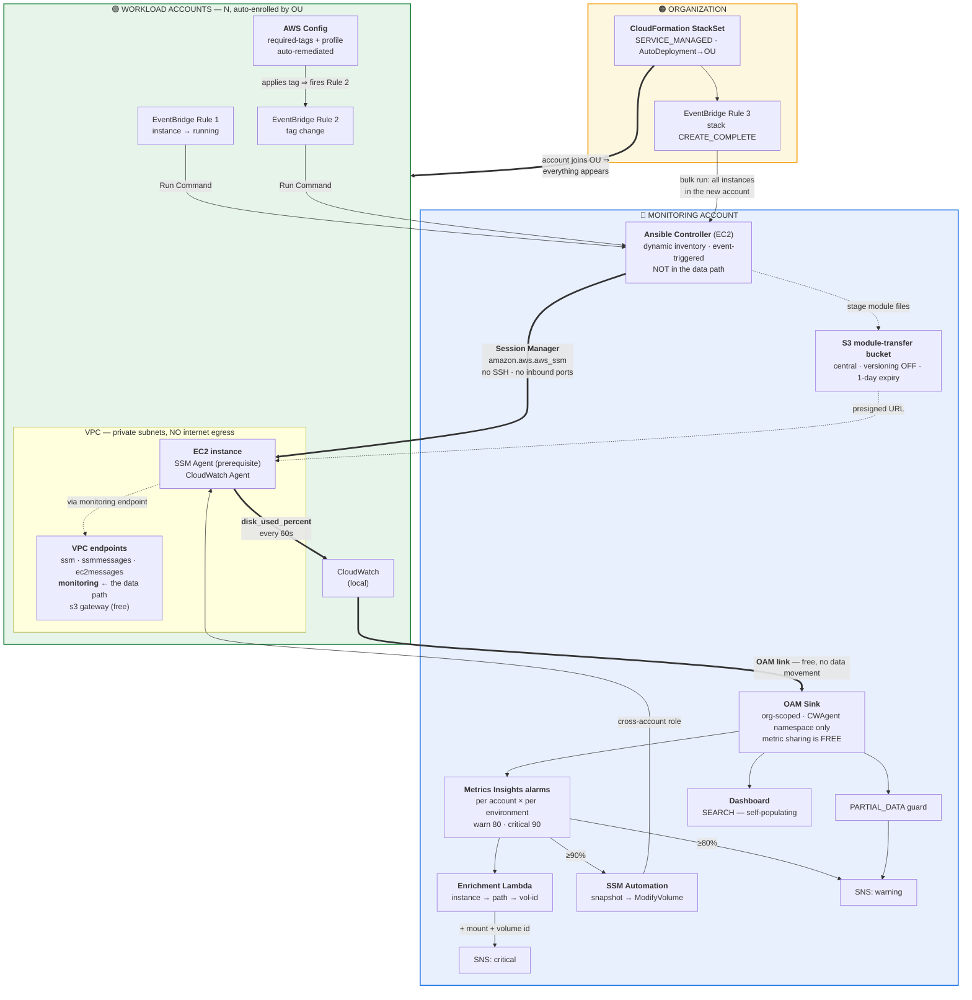
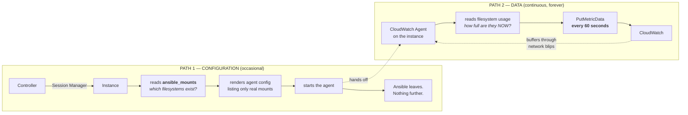
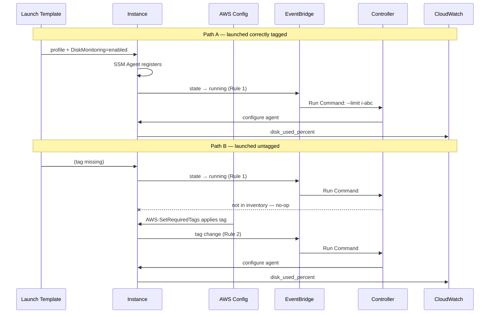
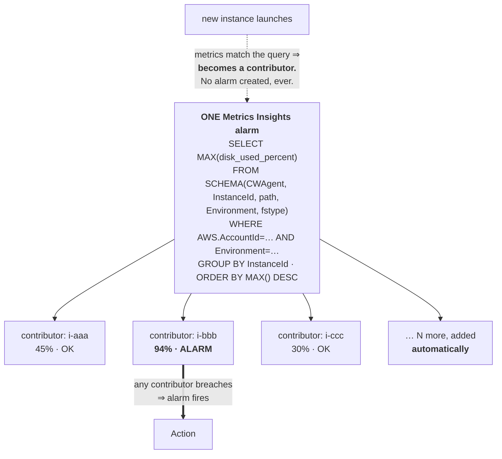
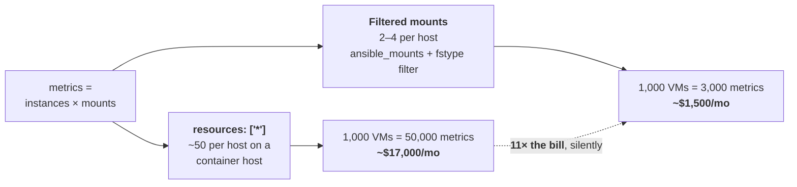
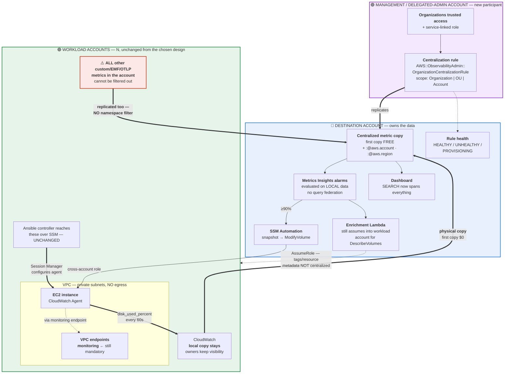

# Architecture

## The premise

**EC2 does not report filesystem fullness.** `AWS/EC2` gives CPU and network only.
`AWS/EBS` metrics measure **I/O activity, not occupancy** — a completely full disk
generates near-zero EBS activity, because nothing can be written, so `BurstBalance`
looks healthy while the application dies.

Filesystem occupancy is an operating-system fact that AWS cannot see. **Therefore an
in-guest agent is mandatory**, and every other decision follows from it.

---

## 1. End-to-end architecture

---

## 2. The two paths — configuration vs. data

The most important structural idea: **Ansible configures, the agent collects.**
These are separate paths with different lifetimes, and Ansible never carries a
measurement.

| | Path 1 — Ansible | Path 2 — Agent |
|---|---|---|
| Question | *Which* filesystems exist? **structural** | *How full* are they? **temporal** |
| Frequency | On trigger | **Every 60s, always** |
| Produces | A config file | A metric stream |
| If it stops | Config goes stale | **Metrics stop — you are blind** |

Ansible *has* the usage numbers (`ansible_mounts` includes `size_available`) and
deliberately discards them: a scheduled tool produces datapoints only when it runs.
There is also **no Ansible module for `PutMetricData`** in any collection — it was
never intended as a metrics pipeline.

---

## 3. Enrollment — three triggers, no scheduler

**Rule 2 is not optional.** With no scheduled sweep, an instance tagged *after* launch
would never be enrolled — the launch event already fired, found the instance absent
from tag-filtered inventory, did nothing, and never fires again. Rule 2 makes Config's
own remediation the enrollment trigger.

**Rule 3** covers a third case Rules 1 and 2 cannot: an acquired account's *existing*
instances. No launch event will ever fire for them, and a tag-change event fires only
if a tag was *missing* — so an instance that **already** carried `DiskMonitoring=enabled`
would generate no event at all.

---

## 4. Why one alarm covers the fleet

**The three alternatives are dead ends:**

| Approach | Why it fails |
|---|---|
| One alarm per VM per mount | 3,000 alarms at 1,000 VMs; a missed creation = **silently unmonitored** |
| `SEARCH()` in an alarm | *"A search expression cannot be used within an Alarm"* — an alarm must resolve to ONE state |
| Metric math | *"maximum of 10 metrics … cannot be increased"* ≈ 3 instances |

**`MAX`, never `AVG`:** a host at 45/94/20% averages to 53% — under an 80% threshold
while a filesystem is nearly full.

**`ORDER BY` is correctness:** past 500 series it decides *which* are evaluated;
descending guarantees the fullest disks are seen.

**The `SCHEMA()` clause names four dimensions, and the fourth is easy to miss.** The agent
emits `InstanceId, path, Environment, fstype` — `drop_device: true` removes `device` but
**not** `fstype`. `SCHEMA()` is an **exact-set** match, so a three-dimension clause matches
nothing at all. Verified live: the three-dimension form returned *"No time series were
returned by the query"* while the four-dimension form evaluated normally on the same data
(`tested_findings.md §2`). Worse, with `TreatMissingData: notBreaching` a zero-match query
reports a reassuring green **`OK` forever** rather than `INSUFFICIENT_DATA`, so
`InsufficientDataActions` never fires and the mismatch is completely silent.

**The alarm names no instance, at any grouping.** A firing fleet alarm carries only
*"1 out of 7 time series evaluated to ALARM"* and an empty `StateReasonData` — adding `path`
to `GROUP BY` does not change that, because the identity lives in the query **result**, never
in the alarm (`tested_findings.md §3`). The enrichment Lambda above is therefore the **only**
path from "something breached" to "this volume needs growing" — **mandatory, not an
enhancement.**

---

## 5. Cost — cardinality, not frequency

`metrics_collection_interval: 60` costs the same as 300 — **frequency is free.** Only
unique dimension combinations are billed. That single `fstype` filter in the Jinja
template is the cost control.

**And it is the only cost control there is, because nothing downstream can undo it.** Once
published, a metric is stored and billed for **15 months**; neither CloudWatch nor OAM can
un-bill it, OAM filters by resource *type* rather than namespace, and `WHERE fstype='xfs'`
hides junk from **view** only (`tested_findings.md §5`). Filtering has to happen on the host
or not at all.

The cardinality model itself is now observed rather than modelled: 2 instances × 2 mounts
produced **exactly 4 metrics**, and the metric tracked filesystem reality — writing 6 GiB
moved `/data` from 1.02% to 61.40% while on-host `df` read 62% (`tested_findings.md §1`).

---

## 6. Key decisions

| Decision | Chosen | Rejected, and why |
|---|---|---|
| Access | **SSM** | SSH — key sprawl across accounts, inbound 22, bastion fleet, no native audit trail |
| Credentials | **Instance profile** | DHMC — profiles take *precedence* over it, so they conflict rather than compose |
| Execution | **Ansible controller** | On-node (`AWS-ApplyAnsiblePlaybooks`) — heavier change management, Ansible on every node, no version pinning |
| Centralization | **OAM** | Metrics Centralization — cannot filter to one namespace, replicates *all* custom metrics; cross-account push — every instance would hold central write credentials |
| Alarming | **Metrics Insights** | Per-VM alarms, `SEARCH()`, metric math — see §4 |
| Enrollment | **Tag + 3 event rules** | Scheduled sweep — dropped; consequence noted below |
| Remediation | **Snapshot → ModifyVolume** | Growth is irreversible ⇒ opt-in tag + size ceiling; root/LVM/RAID excluded by AWS's procedure |

---

## 7. Known limitations

1. **`ModifyVolume` grows the volume, not the filesystem.** Space is unusable by the OS
   until `growpart` + `resize2fs`/`xfs_growfs` run. Remediation therefore notifies
   rather than claiming resolution.
2. **Config verifies configuration, not outcome.** An instance whose agent crashed is
   fully compliant while sending nothing, and **`INSUFFICIENT_DATA` is not the safety net
   it looks like**: with `TreatMissingData: notBreaching` a query matching nothing reports
   green `OK`, verified live (`tested_findings.md §2`). Silence looks like health.
3. **No periodic re-run**, so configuration drift is neither repaired nor detected — a new
   volume on a running instance stayed unmonitored until the config was re-rendered by hand
   (`tested_findings.md §6`). `resources: ["*"]` with a **complete** denylist closes the
   new-volume case with no trigger at all; a stopped agent or an edited config still needs a
   scheduled run.
4. **Single Region.** Alarms cannot watch another Region's metrics; multi-Region needs
   per-Region stacks or Metrics Centralization.
5. **SSM Agent is a prerequisite.** Nothing here can install it — the Ansible
   connection *is* SSM, and no AWS API can run commands inside an instance without it.
6. **Scaling ceilings, in the order they bind:** (a) **SSM managed nodes — 2,400 per account per
   Region**, past which instances may *silently stop communicating* and become unreachable by
   Ansible; (b) **Metrics Insights alarms — 200 per Region, not adjustable**, giving ≈65
   account-environment scopes; (c) **10,000 metrics per query** ≈ 3,300 VMs per scope, where the
   `PARTIAL_DATA` guard makes approach visible. See `quotas.md`.

---

## 8. Alternative — Metrics Centralization and on-node Ansible

The evaluated-but-not-adopted alternative, kept here as the text-based counterpart to
`alternative-architecture.svg`. Metrics Centralization physically replicates metrics into a
destination account rather than federating queries as OAM does; the reasoning, cost arithmetic
and switch triggers are in README §10.

---

## Rendered diagrams

Presentation-ready exports of the two headline architectures, embedded in the README:

- [`main-architecture.svg`](main-architecture.svg) — the chosen hub-and-spoke design
- [`alternative-architecture.svg`](alternative-architecture.svg) — the alternative, showing
  both Metrics Centralization and on-node Ansible
