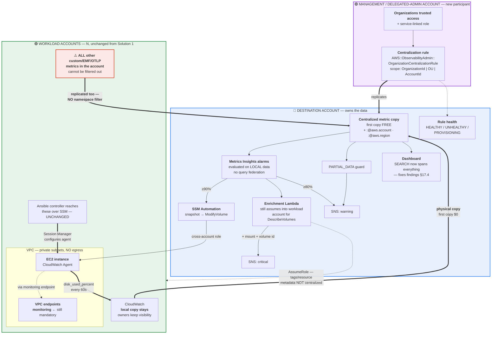
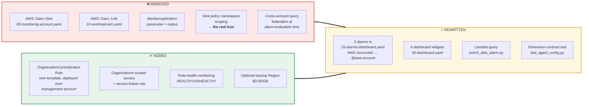
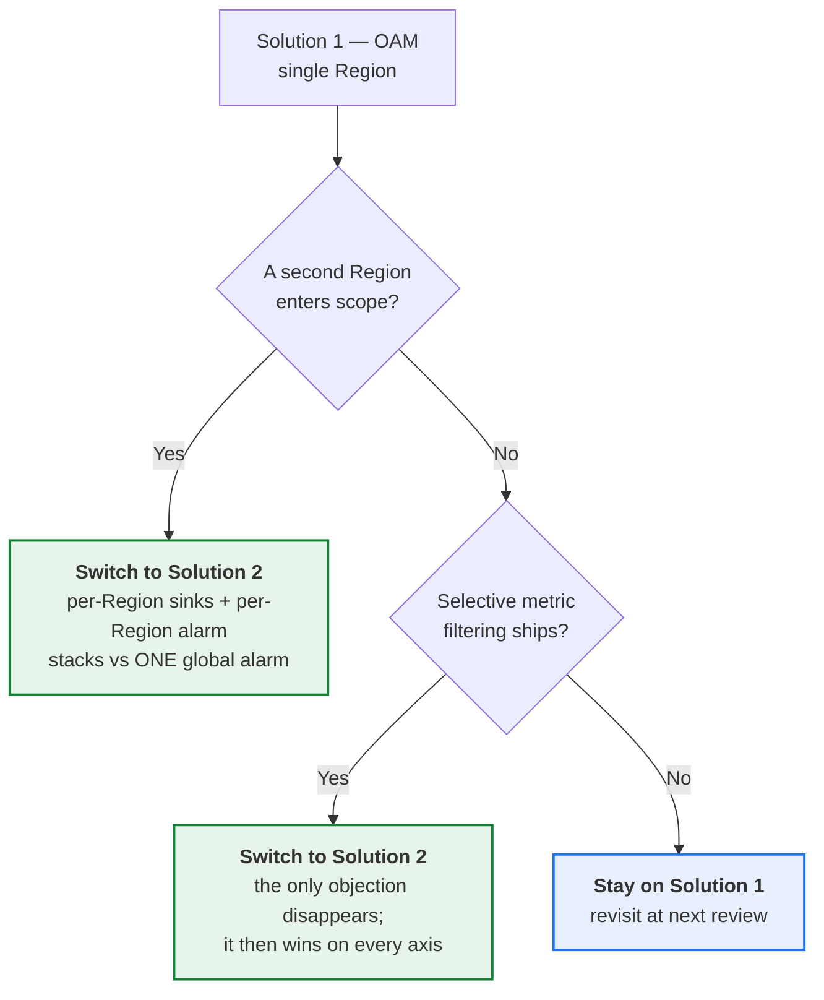

# Solution 2 — Metrics Centralization instead of OAM

An alternative to the aggregation layer of **Solution 1** (`README.md`, `architecture/architecture.md`).
Everything about *collecting* the metric is unchanged; only *how it becomes centrally queryable*
changes.

**Status: evaluated, not adopted.** Solution 1 remains the recommendation at the current
single-Region scope. This document exists because the case for Solution 2 is stronger than
`alternatives.md §7` originally credited, and because it becomes the *correct* answer the moment
either of two triggers fires (§9).

Every AWS claim below is marked **[verified]** against live AWS documentation or **[unverified]**.
That distinction is load-bearing: `findings.md §11` found the original rejection of this option
rested partly on inference stated as fact.

---

## 1. What changes, and what does not

The premise is identical, and worth restating because it is what makes this a *swap* rather than a
redesign: **EC2 does not report filesystem fullness**, so an in-guest agent is mandatory. That is
true under both solutions.

**Metrics Centralization operates on metrics already in CloudWatch** [verified]. It is not a
collection mechanism. So the entire left-hand side of the architecture survives untouched:

| Layer | Solution 1 | Solution 2 |
|---|---|---|
| Access | SSM Session Manager, instance profile, VPC endpoints | **Identical** |
| Execution | Ansible controller, dynamic inventory, S3 module transfer | **Identical** |
| Collection | `cw_agent` role, `ansible_mounts`, fstype filters, `drop_device` | **Identical** |
| Enrollment | Tag + 3 EventBridge rules + Config | **Identical** |
| **Centralization** | **OAM sink + per-account link** | **Organization centralization rule** |
| **Alarm data** | Queried in place, cross-account | **Local copy in destination account** |
| Remediation | SSM Automation, cross-account role | **Identical** |

Roughly **90% of the design is unchanged.** The `monitoring` VPC endpoint is still mandatory —
agents still call `PutMetricData` locally, and centralization copies from there.

---

## 2. Architecture



### The delta, isolated

Everything that actually changes, and nothing that does not:



---

## 3. ⚠️ The highest-risk unknown: does `SCHEMA()` still match?

**This is the first thing to test, and it could invalidate the migration outright.**

Two verified facts collide:

1. `SCHEMA()` is an **exact-set** dimension match — *"the results are scoped down to only those
   metrics that have that exact set of dimensions"* [verified, `findings.md §15`].
2. Centralized metrics have **`:@aws.account` and `:@aws.region` added** [verified].

If those added dimensions become part of the metric's dimension identity, then the existing clause

```sql
FROM SCHEMA("CWAgent", InstanceId, path, Environment, fstype)
```

**matches nothing in the destination account**, and every alarm goes silent. The correct clause
would instead be:

```sql
FROM SCHEMA("CWAgent", InstanceId, path, Environment, fstype, :@aws.account, :@aws.region)
```

**Whether source metadata joins the dimension set or lives on a separate metadata plane is
undetermined** [unverified] — the docs describe the dimensions as "added" without saying whether
`SCHEMA()` sees them.

### The pilot makes this risk MORE credible, and the failure mode worse

Both halves of the risk have now been observed on live metrics [verified,
`tested_findings.md §2`]:

- **Exact-set matching is real and unforgiving.** The agent turned out to emit a fourth
  dimension, `fstype` (`drop_device: true` removes `device`, not `fstype`). A clause naming only
  `InstanceId, path, Environment` matched **nothing** while the four-dimension clause evaluated
  normally on identical data. One missing dimension is enough. An added one is no different, so
  the `:@aws.*` question is not a theoretical edge case — it is the same mechanism that already
  bit this design once.
- **The failure is silent, not `INSUFFICIENT_DATA`.** With the design's own
  `TreatMissingData: notBreaching`, a query matching zero series reports a reassuring green
  **`OK`, forever**: *"No time series were returned by the query. Treat missing data is
  configured as [NonBreaching]."* So `InsufficientDataActions` — the compensating control for
  exactly this failure — **never fires**. This paragraph originally said such alarms would sit in
  permanent `INSUFFICIENT_DATA`; that was wrong, and the correction makes §3 the highest-value
  pre-migration test rather than merely the first one.

Which is why the `list-metrics` check below is not optional paperwork: it is the only thing
standing between a migration and a fleet of green alarms watching nothing.

This is the *same failure mode* as `findings.md §2.1` and the existing Phase 6 dimension gate in
`docs/07`, and it must be settled the same way — empirically, against a real centralized metric,
before any alarm is finalized:

```bash
# In the DESTINATION account, after the rule reaches HEALTHY
aws cloudwatch list-metrics --namespace CWAgent --metric-name disk_used_percent
```

The same caveat applies to the `WHERE` rewrite below: `:@aws.account` is documented as the
dimension name, but its exact quoting inside a `WHERE` predicate is **[unverified]**.

---

## 4. Query rewrites

The shape of the change, gated on §3. Alarm logic — `MAX` not `AVG`, `GROUP BY InstanceId`,
`ORDER BY MAX() DESC` — is unaffected and remains correct for the same reasons.

**Before (Solution 1, OAM):**

```sql
SELECT MAX(disk_used_percent)
FROM SCHEMA("CWAgent", InstanceId, path, Environment, fstype)
WHERE AWS.AccountId = '<1111111111>' AND Environment = 'prod'
GROUP BY InstanceId
ORDER BY MAX() DESC
```

**After (Solution 2, centralized):**

```sql
SELECT MAX(disk_used_percent)
FROM SCHEMA("CWAgent", InstanceId, path, Environment, fstype)   -- ← see §3
WHERE :@aws.account = '<1111111111>' AND Environment = 'prod'
GROUP BY InstanceId
ORDER BY MAX() DESC
```

**And the multi-Region form Solution 1 cannot express at all** — this is the payoff:

```sql
SELECT MAX(disk_used_percent)
FROM SCHEMA("CWAgent", InstanceId, path, Environment, fstype)
WHERE Environment = 'prod'
GROUP BY :@aws.account, :@aws.region, InstanceId
ORDER BY MAX() DESC
```

`fstype` is part of the emitted dimension set under **both** solutions — it is a collection-layer
fact, and §1's table already records collection as identical. Omitting it matches nothing
[verified, `tested_findings.md §2`].

One alarm, every account, every Region. Under Solution 1 this is impossible — sink and link must be
same-Region, and an alarm cannot watch another Region's metrics.

---

## 5. Cost

At the repo's reference fleet: **1,000 VMs × 3 mounts = 3,000 `CWAgent` metrics.**

### 5a. The disk metrics themselves — a wash

| Line item | Solution 1 (OAM) | Solution 2 (Centralization) |
|---|---|---|
| Source-account metric storage | $900 | $900 — paid regardless [verified] |
| Cross-account mechanism | **$0** — *"no additional charge"* [verified] | **$0** — *"first copy … is free"* [verified] |
| Destination storage on the copy | n/a | **$0 or $900 — unresolved, see 5c** |
| Alarms, 3,000 analyzed × 2 thresholds | $600 | $600 — identical [verified] |
| VPC endpoints · controller · dashboard | ~$111 | ~$111 |
| **Total** | **≈ $1,611** | **≈ $1,611 – $2,511** |

**The "OAM is free, centralization costs money" argument does not survive.** Both are $0 for the
first copy. `alternatives.md §7` and `docs/04` overstate this and need correcting regardless of
which solution is adopted.

### 5b. The collateral — this is the deciding number

**Verbatim** [verified]: *"Currently, all metrics from source accounts are centralized. Selective
metric filtering is not supported at this time."*

There is no equivalent of the OAM sink policy's `oam:ResourceTypes` namespace scoping. Every
custom, EMF and OTLP metric in every source account replicates.

Illustrative, using an **assumed** 1,000 unrelated application metrics per account across 50
accounts — the assumption is mine, the arithmetic is the published tiering:

| Destination account holds | Tiered cost |
|---|---|
| 3,000 disk metrics only | 3,000 × $0.30 = **$900** |
| 3,000 disk + 50,000 unrelated | 10,000 × $0.30 + 43,000 × $0.10 = **$7,300** |

So the unrelated import is worth roughly **+$6,400/month at a fleet size where disk monitoring
itself costs $1,500** — and none of it is attributable to this project. That is the case against
Solution 2 in one line, and it is why the original rejection was right even though its stated
reasons were partly wrong.

**And there is no display-time escape hatch** [verified, `tested_findings.md §5`]. The instinct on
seeing unwanted metrics arrive is to filter them at the query or dashboard layer, and that does
nothing to the bill: once published, a metric is **stored and billed for 15 months**, neither
CloudWatch nor OAM can un-bill it, OAM's `oam:ResourceTypes` filters by resource **type** rather
than namespace, and a `WHERE` predicate or an omitted dashboard series hides junk from **view**
only. So the +$6,400 below cannot be tidied away after the fact — it is the price of turning the
rule on, and it is why "selective metric filtering is not supported" is a *cost* statement, not a
usability one.

**Two things it does *not* cost**, both worth stating because the intuition runs the other way:

- **Alarm cost does not move.** Billing is per metric *analyzed*, and `WHERE` still scopes to
  `CWAgent` — so 50,000 unrelated metrics add $0 to the $600 [verified].
- **The 10,000-metric query ceiling is unaffected** for the same reason. The unrelated metrics are
  never matched by the alarm's filter.

### 5c. ⚠️ The unresolved billing question

**Whether the destination account pays custom-metric storage on the copies is undetermined**
[unverified], and it is worth $900/month at this fleet size.

- The pricing page says the **copy operation** is free — it does not say the destination escapes
  per-metric storage.
- The troubleshooting section says *"If the destination account has reached its **metric quota
  limits**, new metrics cannot be ingested"* [verified] — so the copies **definitely consume the
  destination's metric quota**, which hints they are treated as ordinary metrics there.

Both branches are priced in 5a. This needs one look at a billing console in a pilot account, not
more documentation reading. **Do not quote either figure to finance until it is settled.**

### 5d. Additional copies

*"Subsequent copies (e.g., to additional regions or accounts) are charged at $0.05/GB copied"*
[verified]. The published worked example measures GB of **OTLP payload**; **no GB-per-classic-metric
conversion is documented** [unverified], so the cost of a backup Region for `PutMetricData` metrics
cannot be projected from the docs. Treat the backup Region as an unpriced option.

---

## 6. What Solution 2 fixes

Four items in `findings.md` are **OAM artifacts** and disappear rather than being repaired. This is
the genuine argument for Solution 2 and it is stronger than `alternatives.md §7` credits.

| # | Item today | Under Solution 2 |
|---|---|---|
| `§17.4` | The flagship dashboard widget renders **empty** — `SEARCH()` does not span OAM-linked accounts | **Fixed for free.** Centralized data is *local*, and `Search Expressions (SEARCH())` is a fully supported feature on it [verified] |
| `§10` · `limitations §3.11` | `RetainStacksOnAccountRemoval: false` means an **inter-OU move silently deletes the OAM link on a live account** | **Failure class removed** — there is no per-account link resource to delete |
| `limitations §3.1` · assumption 5 | **Single Region.** Alarms cannot watch another Region's metrics | **Fixed.** Cross-Region is the feature's headline capability; see the §4 global query |
| `docs/04` alert path | Alarms evaluate via **cross-account federation** | Removed — *"no cross-account API operations at query time"*, all evaluation is local [verified] |

Supporting this, AWS's own guidance recommends centralization **specifically for our use case**
[verified]: *"Use centralization rules when you require Metrics Insights alarms on cross-account
data, full feature support for metric math and anomaly detection, or data residency in a specific
account for compliance."*

⚠️ **Recorded honestly:** that same article elsewhere presents **OAM + Metrics Insights alarms as a
recommended pattern**. Both are documented as working, so this is not evidence that Solution 1's
alarm design is broken — but Solution 1 rests entirely on OAM-shared Metrics Insights alarms, and
given the docs pull in two directions, that needed proving empirically rather than inferring.

✅ **It has now been proven.** In the pilot the monitoring account `<2222222222>` queried **all 7**
`CWAgent` metrics belonging to workload account `<1111111111>` through the OAM link, and **a single
Metrics Insights alarm created in the monitoring account entered `ALARM` on data from hosts across
the account boundary** [verified, `tested_findings.md §1`]. So the one structural assumption
Solution 1 could not argue its way out of — that OAM-shared metrics are alarmable — is observed
fact. **This removes the strongest reason to migrate defensively**, and leaves Solution 2's case
resting entirely on its two switch triggers in §9.

---

## 7. What Solution 2 does *not* fix

Stated plainly, because the swap touches only the aggregation layer. **Everything in `findings.md
§1` — the part where the chain does not close — is untouched:**

| Still broken | Why unaffected |
|---|---|
| `§1.1` Ansible has no cross-account **connection** credentials | Collection path, not aggregation |
| `§1.2` No event-bus resource policy | Enrollment path |
| `§1.3`–`§1.9` Controller untagged, uncreated; `render_inventory.sh` unscheduled; Rule 3 wrong account; tag transformer reads a non-existent field | Enrollment path |
| **`§2.1` `Environment` silently dropped by the agent** | **Still fatal, still one line — and now confirmed live.** `Environment` appears as a dimension **only** when placed inside the `disk` section's `append_dimensions`; the template's `metrics`-level placement is dropped by AWS [verified, `tested_findings.md §1`]. An agent-config bug — under Solution 2 it breaks the new queries identically |
| **`fstype` missing from every `SCHEMA()` clause** | **Identical under both solutions.** A collection-layer fact (§4), and the same silent green-`OK` failure either way |
| `§2.2` `AWS-SetRequiredTags` unusable | Config remediation |
| `§2.3` The phantom 6-hour EBS guard | Remediation |
| `§3` Tests validate a Python reimplementation | Test design |
| `§5` · `§6.1` Remediation cannot execute | Remediation |
| `§7` Guard alarm fires at ~7 metrics | Threshold arithmetic — the query changes, the bug does not |
| `§8` Enrichment Lambda wired to nothing | Not deployed either way |
| `§4` Azure and GCP absent | Brief compliance |

**Also not improved:** `limitations §3.3` (resource tags unavailable centrally). Resource metadata
is **not** centralized — the docs note automatic dashboards have only partial support *"because
they depend on resource metadata that is not centralized from source accounts"* [verified]. So the
enrichment Lambda still needs `sts:AssumeRole` into the workload account for `DescribeVolumes`.
Marginally *worse* than OAM here, since resource-tags-for-telemetry does work cross-account via OAM
— just not for `CWAgent` (`findings.md §15`).

---

## 8. New costs and constraints

| Constraint | Detail |
|---|---|
| **A new deployment location** | Rules are created *"in the Management or Delegated Administrator account"* [verified]. **This repo currently deploys nothing from the management account** — a new governance surface. It also compounds `findings.md §17.3`, which found the monitoring account is neither management nor delegated admin, so `organizations:ListAccounts` already fails |
| **Trusted access + service-linked role** | Must be enabled for CloudWatch; AWS recommends the console path because it creates the SLR automatically, otherwise the SLR must be created separately [verified] |
| **A replication pipeline to operate** | Health is only `HEALTHY` / `UNHEALTHY` / `PROVISIONING` [verified]. `limitations` gains an item; there is no equivalent under OAM, which moves no data |
| **Destination metric quota** | Copies consume it, and exhausting it means *"new metrics cannot be ingested"* [verified] — a silent-degradation mode to add to `quotas.md` |
| **Not retroactive** | Only new data after rule creation [verified] — same as OAM, no change |
| **Alarm quota still binds** | 200 Metrics Insights alarms per Region, `Adjustable: No`. Multi-Region consolidation means all alarms live in the destination Region's single quota, but the global query in §4 needs *fewer* alarms because Region becomes a `GROUP BY` rather than a shard. Net direction is favourable; the magnitude is **derived arithmetic, not a documented combined limit** — same caveat as the ≈65-scope figure in `quotas.md` |
| **Workload owners keep local visibility** | Preserved — the source copy stays [verified]. Neither solution takes visibility away from account owners |

---

## 9. Decision and switch triggers

**Keep Solution 1 (OAM) at the current single-Region scope.** The conclusion in `alternatives.md §7`
was right, but for only one of its stated reasons: **the absence of namespace filtering is the whole
case.** Solution 2 would import unbounded unrelated cardinality — potentially +$6,400/month of
metrics belonging to other teams — to solve a problem OAM solves at $0.

The cost argument the repo also relied on is **wrong and should be struck** from
`alternatives.md §7` and `docs/04`: both mechanisms are free for the first copy.

**Switch to Solution 2 when either trigger fires:**



At that point Solution 2 is **clearly better, not merely equivalent** — it is the same cost, it
deletes four defects, and it is what AWS recommends for cross-account Metrics Insights alarming.

**Migration is additive and reversible.** Both mechanisms can run simultaneously: create the
centralization rule, verify §3 against real centralized metrics, deploy a parallel alarm stack in
the destination account, compare against the OAM alarms, and only then delete the sink and links.
Nothing about the collection path is disturbed at any point.

---

## 10. Verification ledger

| Claim | Status |
|---|---|
| *"all metrics … Selective metric filtering is not supported at this time"* | **[verified]** verbatim |
| Supported types: custom (PutMetricData), EMF, OTLP — **excludes AWS service metrics** | **[verified]** — was inference in `alternatives.md`, now confirmed |
| First copy free; subsequent $0.05/GB | **[verified]** |
| OAM sharing has no additional charge | **[verified]** |
| `:@aws.account` / `:@aws.region` added to centralized metrics | **[verified]** |
| Full feature support incl. `SEARCH()`, Metric Math, Anomaly Detection, Metrics Insights alarms | **[verified]** |
| Copies consume destination metric quota | **[verified]** |
| Rule health `HEALTHY`/`UNHEALTHY`/`PROVISIONING`; not retroactive | **[verified]** |
| Rules created from management or delegated-admin account; trusted access + SLR required | **[verified]** |
| CFN: `AWS::ObservabilityAdmin::OrganizationCentralizationRule` | **[verified]** |
| AWS recommends centralization for cross-account Metrics Insights alarms | **[verified]** |
| **Whether destination copies bill as custom metrics** | **[unverified]** — worth $900/mo; pilot billing check |
| **Whether `:@aws.*` joins the `SCHEMA()` dimension set** | **[unverified]** — could break every alarm; see §3 |
| **`:@aws.account` quoting inside `WHERE`** | **[unverified]** |
| GB-per-classic-metric conversion for backup-Region cost | **[unverified]** — example is OTLP-only |
| *"GA June 2026"* as stated in `alternatives.md:129` | **[unverified]** — no GA date in any page read |
| `CentralizationError` belongs to metrics centralization (`docs/04:75`) | **Refuted** — it is `AWS/Logs`, for *Logs* centralization. `findings.md §11` was right |

### Promoted from inference to observation by the live pilot

These were previously argued from documentation. They are now **[empirically verified]** in
`tested_findings.md`, which changes how much weight §3 and §6 can carry.

| Claim | Status |
|---|---|
| **The agent emits FOUR dimensions**, `InstanceId, path, Environment, fstype` — `drop_device` does not remove `fstype` | **[empirically verified]** `§2` — the repo's three-dimension `SCHEMA()` matched **nothing** |
| A `SCHEMA()` mismatch reports green **`OK`**, not `INSUFFICIENT_DATA`, so `InsufficientDataActions` never fires | **[empirically verified]** `§2` — **corrects this document's own §3** |
| `SCHEMA()` exact-set matching is real and unforgiving in practice, not just in the docs | **[empirically verified]** `§2` — raises the credibility of the `:@aws.*` risk in §3 |
| **OAM shares metrics cross-account**, and **a Metrics Insights alarm evaluates on them** | **[empirically verified]** `§1` — monitoring `<2222222222>` queried all 7 metrics of workload `<1111111111>`; the warning alarm entered `ALARM` across the boundary. Settles the §6 caveat |
| `Environment` is dropped unless placed in the **`disk` section's** `append_dimensions` | **[empirically verified]** `§1` — the one-line fix is correct and necessary |
| No display-time filtering exists; a published metric is billed for **15 months** | **[empirically verified]** `§5` — makes §5b's collateral irreducible |
| A fleet alarm carries **no identity at any `GROUP BY`** — only a count | **[empirically verified]** `§3` — the enrichment Lambda in §2's diagram is **mandatory** under both solutions |
| Cardinality is `instances × mounts`, and the metric tracks `df` | **[empirically verified]** `§1` — 2 × 2 = exactly 4 metrics; 6 GiB written moved `/data` to 61.40% vs `df` 62% |

⚠️ **Not promoted:** everything specific to Solution 2. **No centralization rule was created in the
pilot**, so §3's `:@aws.*` question, §5c's destination-billing question and §5d's GB conversion all
remain **[unverified]**. The pilot validated the *shared* collection and alarm layers; it says
nothing about the replication layer.

All pricing is **single-Region list price** read from the published pricing page; the Pricing API
needs credentials. Ratios hold; **absolute totals are not quotable to finance.**

---

## Files this would change

| File | Change |
|---|---|
| `cloudformation/00-monitoring-account.yaml` | Remove `AWS::Oam::Sink` + policy, `SinkArn` output |
| `cloudformation/10-workload-iam.yaml` | Remove `AWS::Oam::Link`, `MonitoringSinkArn` parameter, `OamLinkArn` output |
| **new** `cloudformation/40-centralization-rule.yaml` | `OrganizationCentralizationRule` — deployed from the management/delegated-admin account |
| `cloudformation/20-alarms-dashboard.yaml` | Rewrite 3 alarm queries (§4), gated on §3 |
| `cloudformation/30-dashboard.yaml` | Rewrite 4 widget queries; `§17.4` resolves as a side effect |
| `lambda/enrich_disk_alarm.py` | Rewrite `find_breaching_mounts()` query; `_scope_from_alarm_name` unchanged |
| `tests/test_agent_config.py` | `test_alarm_schema_matches_emitted_dimensions` must accept the centralized dimension set |
| `quotas.md` | Add destination metric quota; revise the OAM section |
| `limitations.md` | Remove §3.1 and §3.11; add replication-pipeline health |
| `alternatives.md §7` · `docs/04 §4a` | Strike the cost argument; keep and sharpen the filtering argument |

## See also

- `README.md` · `architecture/architecture.md` — Solution 1, the recommendation
- `alternatives.md §7` — the original rejection, whose cost reasoning §5a corrects
- `findings.md §11` · `§15` · `§17.4` — the verification findings that prompted this document
- `docs/04-aggregation-alarming.md` — the OAM/alarm design Solution 2 would replace
- `quotas.md` — quota interactions, including the non-adjustable 200-alarm limit
